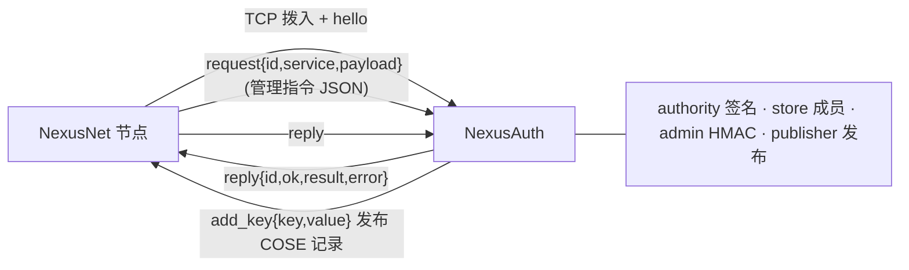

# NexusAuth

**NexusNet 鉴权权威边车** — 签发并发布鉴权网络的 COSE 白名单/索引记录。

NexusAuth 是 NexusNet 鉴权网络中的「权威」：持有权威 ed25519 私钥，维护每个服务的 PeerId 白名单，把签名后的记录经本地节点发布到 DHT，并定时续期。NexusNet 节点侧只配置权威**公钥**，收到服务请求时按「DHT 为准 + fail-closed」判定。

> 记录格式、验证算法与常量见 NexusNet 的 `docs/auth.md`；本边车负责其中的**发布侧**。

## 架构



- 节点主动拨入并握手；NexusAuth 通过 `add_key` 把白名单/索引写入 DHT。
- 管理指令以 JSON 经 `request` 到达，**必须携带有效 `mac`**（见下）。
- 一个实例只服务一个鉴权网络（`config.network`）。

## 快速开始

```bash
cargo run
```

首次运行自动生成 `./config.toml`（权限 `0600`）：

```toml
port = 5100
network = ""                       # 必填：鉴权网络名
authority_key_path = "./authority.key"
state_path = "./auth_state.toml"
expires_secs = 3600
renew_secs = 1200
management_password = ""           # 必填：为空则拒绝启动

join_mode = "require"              # require（默认，必须入网）/ init（生成新权威，首个节点）
join_peers = []                    # 候选边车节点 PeerId（DHT 发现为空时兜底）
join_service = "auth"              # 目标节点上边车的服务名
join_timeout_secs = 30             # 入网总超时
join_retry_secs = 5                # 单轮失败重试间隔
allow_join = true                  # 是否响应他人的入网请求
```

设置 `network` 与 `management_password` 后启动，日志会打印权威公钥：

```
[IMPORTANT] 权威公钥
    mAah3/WQQNjC65rGrWYe01bjz0WwEcfdI3m7Gz2pRqo=（填入 NexusNet auth.networks.<network>.authority）
```

## 权威密钥与 DHT key 布局

- `authority.key`：裸 32 字节 ed25519 seed，权限 `0600`；不存在则随机生成。
- 公钥（标准 base64 的 32 字节）填入 NexusNet `[auth.networks.<network>].authority`。
- `net_hash = base64url_nopad(SHA-256(network))`
- 索引 key：`/oahd/auth/<net_hash>/service`
- 白名单 key：`/oahd/auth/<net_hash>/<service>`

记录为 COSE_Sign1（`alg = EdDSA`，`external_aad` = key 路径字节），payload 为 CBOR：

```
WhitelistDoc = { "version": uint, "members": [ tstr ] }
IndexDoc     = { "version": uint, "expires_at": uint,
                 "services": [ { "name": tstr, "hash": bstr(32), "length": uint } ] }
```

## 入网引导（join）

新边车本地无 `authority.key` 时，由 `join_mode` 决定：

- `init`：生成新权威密钥，成为网络首个节点（**初始化网络时显式设置**）。
- `require`（默认）：必须从在线边车取回密钥，否则超时退出（fail-closed）。

流程：

1. 首个节点连接建立后，查询**正常服务列表** `/oahd/service/<join_service>` 的 providers 得到已入网边车的节点 PeerId，并合并配置的 `join_peers`（自身节点也在列表中，对其请求会失败并被跳过）。
2. 向候选发送单轮证明 `join_request`：`mac = HMAC(K_mac, network‖nonce‖ts)`，`K_mac = HKDF(password, salt="nexusauth/join", info=network)`。
3. 响应方校验 mac/ts/nonce 后，用双方 nonce 与密码派生的密钥以 `ChaCha20-Poly1305` 加密返回 `{ seed, 状态快照 }`，并用响应 mac 双向认证。
4. 新边车校验（DHT 已有索引则用新公钥验签）、持久化 `authority.key`(0600) 与 `auth_state.toml`(0600)，**随后才启动发布**。

安全：请求/响应**不含明文密码**；离线爆破防护依赖**高熵管理口令**（本协议不做 PAKE）。

## 管理/状态指令

经 NexusNet 转发的 `request.payload` 为 JSON：

```json
{
  "op": "add_members",
  "service": "cmd",
  "peers": ["12D3KooW..."],
  "nonce": "<base64url 16B>",
  "ts": 1700000000,
  "mac": "<base64url>"
}
```

- `K_mac = HKDF-SHA256(management_password, salt="nexusauth/mgmt", info=network)`
- `mac = HMAC-SHA256(K_mac, json({op, service, peers排序, nonce, ts}))`
- **请求不携带明文密码**；`mac` 即「持有密码」的证明。
- 校验：先验 `mac`，再验 `ts`（偏差 ≤ 300s），最后 nonce 去重（进程内有界）。
- 回复：`reply.result` 为 JSON。

| op | 参数 | 说明 |
|---|---|---|
| `status` | — | 网络 / 权威公钥 / 索引版本 / 各服务版本与成员数 / 连接数 / 运行时长 |
| `export_authority_pubkey` | — | 返回权威公钥 |
| `list_services` | — | 服务名列表 |
| `list_members` | `service` | 该服务成员与版本 |
| `add_members` | `service`, `peers` | 增加成员 |
| `remove_members` | `service`, `peers` | 移除成员 |
| `set_members` | `service`, `peers` | 整体替换成员 |
| `create_service` | `service`, `peers?` | 新建服务（初始成员可选） |
| `delete_service` | `service` | 删除服务 |
| `publish_now` | — | 立即触发一次发布 |

成员增删仅在**真正变化**时提升该服务与索引版本；任何变更都会触发一次重签发布。

## 发布与续期

- 节点握手成功即注册连接并触发发布；无连接时静默等待，连接后补发。
- 发布顺序：**先各服务白名单，后索引**（索引引用白名单的 `hash`/`length`）。
- 每 `renew_secs` 续期：索引重签（`expires_at` 前移、`version+1`），白名单重发相同字节刷新 DHT TTL。
- 每条记录对所有在线连接发布；失败退避重试（3 次），下次续期再试。
- `renew_secs` 应小于 `expires_secs`，且小于节点侧 Kademlia `record_ttl_seconds`。

## 多边车状态复制

同一鉴权网络可有多个边车；成员变更在边车间复制，保证最终一致。

- **变更广播 `replicate`**：本地管理变更应用后，异步向服务列表中发现的所有边车广播单服务变更（删除带墓碑），按服务版本 **LWW** 合并；失败不重试。
- **反熵同步 `sync_request` / `sync_response`**：每 `renew_secs` 向一个对端拉取全量快照（含墓碑）并按版本合并，治愈离线期间漏掉的变更。
- **认证**：`K_rep = HKDF-SHA256(password, salt="nexusauth/replicate", info=network)`，`mac` 覆盖服务/版本/成员/墓碑/nonce/ts；删除以墓碑版本防止旧复制复活。
- 复制消息不加密（成员列表公开），仅做完整性认证。

**收敛与可用性（无选主）**：所有边车都可发布，记录幂等；任一存活边车续期即可维持 DHT 记录，故**故障接管天然成立**。并发/乱序用**确定性合并**收敛：

- 按服务版本 LWW；**删除在同版本上胜出**（防 delete/update 并发分叉）；
- 同版本不同内容时按**成员集合规范哈希择大**，双方最终取同一内容；
- 索引版本取 `max`。

代价：各边车续期时独立自增 `index_version`（版本号可能短暂不同），但内容一致；低版本发布被节点回滚保护忽略后，会由版本更高的边车随续期补发，最终一致。

## 与 NexusNet 对接

在 NexusNet 的 `config.toml` 中登记后端，并把权威公钥写入对应网络：

```toml
[auth]
network = "myorg"
cache_ttl_secs = 300
refresh_interval_secs = 60

[auth.networks.myorg]
authority = "<NexusAuth 打印的 base64 公钥>"

[[services.dispatcher.local_services]]
name = "auth"          # 实际调用名由节点侧决定，不能是保留名 "service"
host = "127.0.0.1"
port = 5100            # 与 NexusAuth config.port 一致
require_auth = false   # 权威自身不参与服务鉴权，避免循环
```

启动 NexusAuth 后再启动 NexusNet，节点日志出现「后端连接建立」且完成 hello 握手即接入成功。

## Debian 安装

```bash
cargo build --release
./deploy/build-deb.sh
apt install -y ./target/packaging/nexusauth_<version>_amd64.deb
```

配置 `/etc/nexusauth/config.toml`、密钥与状态 `/var/lib/nexusauth/`，日志交给 journald。
路径由 `NEXUSAUTH_HOME` / `NEXUSAUTH_CONFIG` / `NEXUSAUTH_LOG_PATH` / `NEXUSAUTH_AUTHORITY_KEY` / `NEXUSAUTH_STATE` 锚定；本地 `cargo run` 不设变量时读写当前目录。

> 注意：默认与 NexusNet 共用 `nexusnet` 账号，同账号进程可读 `authority.key`；如需隔离请改用独立账号。详见 [`deploy/README.md`](./deploy/README.md)。

## 模块清单

| 模块 | 职责 |
|------|------|
| **main** | 入口：配置、构建上下文、监听、启动发布循环、优雅关闭 |
| **config** | `config.toml` 加载/生成（`0600`）与访问器 |
| **paths** | 路径解析：环境变量锚定 systemd 目录，本地回退当前目录 |
| **authority** | 权威密钥、`net_hash`/key 布局、COSE_Sign1 签名 |
| **store** | 服务→成员集合+版本，原子落盘（`0600`） |
| **admin** | 管理密码 HMAC 认证与 nonce/ts 防重放 |
| **join** | 入网引导：发现、单轮证明、AEAD 取回 `K_auth` 与状态 |
| **replicate** | 多边车状态复制：变更广播与反熵同步 |
| **publisher** | 连接注册、发布、续期、重试 |
| **service** | 入站管理/状态指令与入网请求处理 |
| **context** | 运行时共享状态（`AuthContext`） |
| **runtime** | 延迟就绪（入网协调）与发布循环装配 |
| **replay** | 有界 nonce 去重（管理认证与入网共用） |
| **connection** | 握手、读写循环、pending 表、`BackendClient` |
| **protocol** | 节点↔后端 v2 契约：`Message`、帧编解码 |
| **fsutil** | 原子写入辅助 |
| **log** | 分级日志：终端彩色 + 文件轮转；systemd 下自动切换 journald |

## 后端协议 v2

帧：`u32_be(len) || cbor(message)`（`len ≤ 16 MiB`）；连接首帧必须为 `hello`，`PROTOCOL_VERSION = 2`。

判别字段为文本 `t`：`hello` / `request` / `reply` / `list_services` / `discover_providers` / `query_public_ip` / `reconnect_bootstrap` / `reannounce_services` / `reload_config` / `relay_status` / `pq_status` / `auth_status` / `query_key` / `add_key` / `service_request` / `service_request_to`。

- 关联 id 为 UUID（线上编码为 16 字节 CBOR `bstr`）。
- `add_key` 的 `value` 为 `bstr`，二进制安全；本边车以 `providing = false` 写入记录。
- 控制指令默认超时 60 秒。

## 测试与 CI

```bash
cargo fmt -- --check
cargo test --verbose
cargo build --release
./deploy/build-deb.sh
```

CI（`.gitea/workflows/rust-ci.yml`）在每次 push 执行格式检查、测试与 release 构建；当 `main` 分支上 `Cargo.toml` 版本未打 tag 时，自动构建 `.deb` 并创建 Gitea Release。

## 阶段与限制

已实现**入网引导**（发现 + 取回 `K_auth` 与状态）、**多边车状态复制**（变更广播 + 反熵同步）与**确定性收敛 / 内建故障接管**。

**不引入选主/租约**：多发布者幂等且高可用，以确定性合并（LWW + 删除胜出 + 规范哈希择大）保证最终一致；代价是各边车续期时 `index_version` 可能短暂不同。
