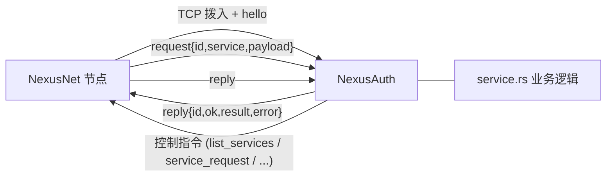

# NexusAuth

**NexusNet 后端服务脚手架** — 实现「节点 ↔ 边车/后端」协议 v2（CBOR + CDDL 契约）。

本模板提供一个可直接运行的后端进程：NexusNet 节点主动拨入并完成握手，之后既可转发入站服务请求，也可由后端主动发起控制指令。业务逻辑只需在 [`src/service.rs`](./src/service.rs) 中填空。

## 架构



- 一个模板进程只监听一个端口，对应 NexusNet 侧的一个服务。
- **服务名由 NexusNet 决定**：`[[services.dispatcher.local_services]]` 的 `name` 会随每个 `request.service` 字段到达，模板自身不配置服务名。
- 协议实现位于 [`src/protocol.rs`](./src/protocol.rs)（帧与消息）与 [`src/connection.rs`](./src/connection.rs)（握手、读写循环、控制句柄）。

## 快速开始

```bash
cargo run
```

首次运行自动生成 `./config.toml`：

```toml
port = 5100
```

监听地址固定为 `127.0.0.1:{port}`（需与 NexusNet 配置的 `host` 对应）。

## Debian 安装

除 `cargo run` 外，模板同样支持标准的 Debian `.deb` + systemd 部署（参考 NexusNet）。
包名 / 单元名 / 二进制名自动从 `Cargo.toml` 的 `name` 派生并规范化（`NexusAuth` → `nexusauth`）；
运行账号固定为 NexusNet 的专用用户 `nexusnet`（与节点共用，缺失时由 postinst 创建，模板不负责删除）。

```bash
cargo build --release
./deploy/build-deb.sh
apt install -y ./target/packaging/nexusauth_<version>_amd64.deb
```

安装后以 `nexusnet` 用户运行，配置位于 `/etc/nexusauth/config.toml`（首启自动生成），
日志交给 journald。路径由 `NEXUSAUTH_HOME` / `NEXUSAUTH_CONFIG` / `NEXUSAUTH_LOG_PATH`
环境变量锚定；本地 `cargo run` 不设变量时仍读写当前目录。

详见 [`deploy/README.md`](./deploy/README.md)。

## 后端协议 v2

### 帧

```text
u32_be(len) || cbor(message)      # len <= 16 MiB
```

连接建立后**双方首帧必须是 `hello`**，版本不兼容则断开。当前 `PROTOCOL_VERSION = 2`。

### 消息

判别字段为文本 `t`：

| `t` | 方向 | 说明 |
|---|---|---|
| `hello` | 双向 | 握手与版本协商 |
| `request` | 节点 → 后端 | 转发入站服务请求 `{ id, service, payload }` |
| `reply` | 双向 | 关联回复 `{ id, ok, result?, error? }` |
| `list_services` | 后端 → 节点 | 列出全局服务类型 |
| `discover_providers` | 后端 → 节点 | 查询某服务的提供者 |
| `query_public_ip` | 后端 → 节点 | 查询本节点公网地址 |
| `reconnect_bootstrap` | 后端 → 节点 | 重新拨号 bootstrap |
| `reannounce_services` | 后端 → 节点 | 重新宣告本地服务 |
| `reload_config` | 后端 → 节点 | 重载节点配置 |
| `relay_status` | 后端 → 节点 | 中继状态 |
| `pq_status` | 后端 → 节点 | 抗量子状态 |
| `auth_status` | 后端 → 节点 | 鉴权状态 |
| `query_key` | 后端 → 节点 | 读取 DHT 记录 |
| `add_key` | 后端 → 节点 | 写入 DHT 记录 / 宣告提供 |
| `service_request` | 后端 → 节点 | 发起 P2P 服务调用（自动选优） |
| `service_request_to` | 后端 → 节点 | 向指定 peer 发起 P2P 服务调用 |

- 关联 id 为 UUID（线上编码为 16 字节 CBOR `bstr`）。
- `reply.result` 是各 op 自定的 **CBOR** 字节；`add_key` 的 `value` 为 `bstr`，二进制安全。
- 控制指令默认超时 60 秒（与节点侧 `dispatcher.query_timeout_secs` 对齐），超时以 `error{code:"timeout"}` 应答。

### `reply.result` 负载

| op | result |
|---|---|
| `list_services` | `[* tstr]` |
| `discover_providers` | `[* tstr]`（PeerId 字符串） |
| `query_public_ip` | `{ ? ipv4: tstr, ? ipv6: tstr }` |
| `reconnect_bootstrap` | `{ success: bool }` |
| `reannounce_services` / `reload_config` | `{ success: bool, ? error: tstr }` |
| `relay_status` | `{ need_relay: bool, target: uint, active: [* tstr], pending: [* tstr] }` |
| `pq_status` | `{ enabled: bool, transport: bool, identity: bool, required: bool }` |
| `auth_status` | `{ network: tstr, state: tstr, local_required: [* tstr], ... }` |
| `query_key` | `{ key: tstr, ? value: bstr, ? providers: [* tstr] }` |
| `add_key` | `{ success: bool, key: tstr }` |
| `service_request*` | 原始服务响应字节 |

## 业务实现

在 [`src/service.rs`](./src/service.rs) 的 `handle_service_request` 中实现：

```rust
pub async fn handle_service_request(
    service: &str,
    payload: &[u8],
    client: &BackendClient,
) -> Result<Vec<u8>, SidecarError> {
    let req: serde_json::Value = serde_json::from_slice(payload)
        .map_err(|e| SidecarError::new("invalid_request", e.to_string()))?;

    // ... 处理业务，必要时调用 client 的控制指令 ...

    Ok(serde_json::to_vec(&serde_json::json!({ "ok": true })).unwrap())
}
```

- 返回 `Ok(bytes)` → 节点以 `reply { ok: true, result: bytes }` 应答。
- 返回 `Err(SidecarError)` → 节点以 `reply { ok: false, error }` 应答。
- 默认实现为原样回显，便于端到端自测。

## 控制指令

`BackendClient` 提供全量 typed helper，直接返回已解码的结果：

```rust
use crate::protocol::{PublicIpInfo, QueryKeyResult};

let ip: PublicIpInfo = client.query_public_ip().await?;
let providers: Vec<String> = client.discover_providers("ocr").await?;
let record: QueryKeyResult = client.query_key("/oahd/service/ocr").await?;

client.add_key("/oahd/service/ocr", Some(b"meta".to_vec()), true).await?;

let raw: Vec<u8> = client.service_request("ocr", payload).await?;
let raw: Vec<u8> = client.service_request_to("ocr", "12D3KooW...", payload).await?;

client.reconnect_bootstrap().await?;
client.reannounce_services().await?;
client.reload_config().await?;
client.relay_status().await?;
client.pq_status().await?;
client.auth_status().await?; // -> serde_json::Value
```

结果结构体定义见 [`src/protocol.rs`](./src/protocol.rs)（`PublicIpInfo`、`QueryKeyResult`、`RelayStatusResult`、`PqStatusResult`、`SuccessResult`、`AddKeyResult`）。

## 与 NexusNet 对接

在 NexusNet 的 `config.toml` 中登记后端（`name` 由节点侧决定，`port` 与本模板 `config.toml` 一致）：

```toml
[[services.dispatcher.local_services]]
name = "example"
host = "127.0.0.1"
port = 5100
require_auth = false
```

启动本模板后再启动 NexusNet，节点日志出现「后端连接建立」且完成 hello 握手即接入成功。

## 模块清单

| 模块 | 职责 |
|------|------|
| **main** | 入口：配置、监听、accept、优雅关闭 |
| **config** | `config.toml` 加载/生成（仅 `port`）与 `ConfigHandle` |
| **paths** | 路径解析：环境变量锚定 systemd 目录，本地回退当前目录 |
| **log** | 分级日志：终端彩色 + 文件轮转（10MB 触发 gz）；systemd 下自动切换 journald |
| **protocol** | v2 契约：`Message`、result 结构体、帧编解码 |
| **connection** | 握手、读写循环、pending 表、`BackendClient` |
| **service** | 业务逻辑占位（TODO） |

## 测试与 CI

```bash
cargo fmt -- --check
cargo test --verbose
cargo build --release
./deploy/build-deb.sh
```

CI（`.gitea/workflows/rust-ci.yml`）在每次 push 执行格式检查、测试与 release 构建；
当 `main` 分支上 `Cargo.toml` 版本未打 tag 时，自动构建 `.deb` 并创建 Gitea Release 上传二进制与 deb。

## 迁移说明

旧版 UUID 帧协议（`[uuid_len][uuid][payload_len][payload]`）已被 CBOR v2 契约**完全取代**，使用旧模板的后端需同步升级到本版本。
